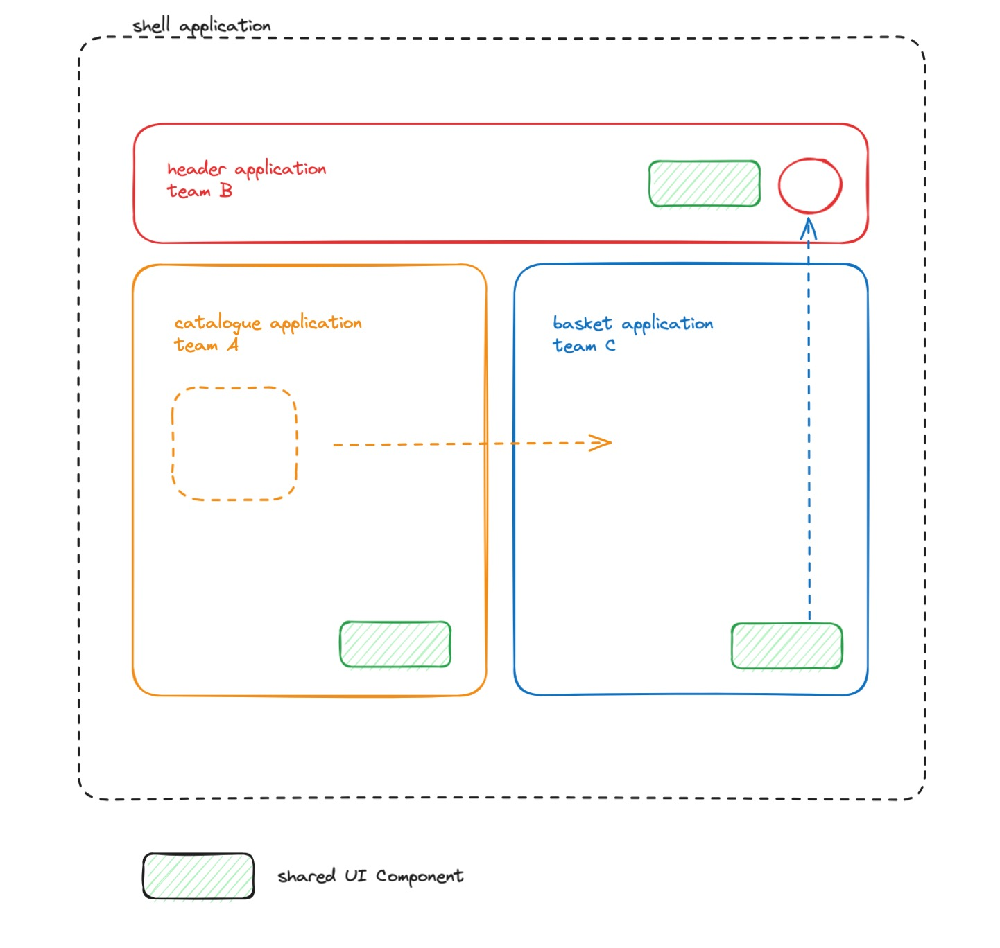

# MMT MFE Shell page

**Current CDN Distribution:** [condemned-muscle.surge.sh](https://condemned-muscle.surge.sh)



## Remote Application repos

`npm create vite@latest`

- header https://github.com/mmt-mfe-workgroup/header/tree/master
- catalogue https://github.com/mmt-mfe-workgroup/catalogue/tree/master
- basket https://github.com/mmt-mfe-workgroup/catalogue/tree/master

:bulb: We will need to align exposing App import statements and any load procedures.

:bulb: Is the remote application **mounted** by the _shell_ or it is **imported** as a shared remote resource? => we need a way to define its Federated module **_type_**

## MFE Shared configs

Ensure other apps share these commonalities in their respective `package.json`

```
"type": "module",
 "config": {
    "cdn": "CDN_LOCATION"
 },
"scripts": {
    "deploy": "npm run build && cd dist && echo '*' > CORS && echo $npm_package_config_cdn | pbcopy && npx surge && cd .."
 },
"devDependencies": {
    "@originjs/vite-plugin-federation": "^1.3.4",
    "surge": "^0.23.1",
}
```

```
npm install @originjs/vite-plugin-federation surge --save-dev
```

### Deployment (for all Apps)

`npm run deploy`

1. Builds to `/dist`
2. Copies CORS stuff for **surge**
3. Copies CDN location to :clipboard: clipboard
4. **surge** asks to confirm build location
5. **surge** asks for CDN location => clear then paste :wink:

:bomb:

## Federated modules: remotes | exposures

Ensure you have a `vite.config.js`

```
const fm = () => federation({
    name: 'app-name',
    filename: 'remoteEntry.js',
    remotes: {
				'Header': `https://${CDN_LOCATION}/assets/remoteEntry.js`
		},
		exposes: {
        './Button': './src/components/Button', // !important
    },
    shared: ['react']
})

export default defineConfig({
  plugins: [react(), fm()],
  build: {
    target: 'esnext' // !important for ESM exposure
  }
})
```

## Shell import Apps which Mount with ReactDom

```
const basket:any = () => import("basket/App"); // lazy
const runtimeParams = "root" // HTMLElement
basket()
	.then(fmodule => fmodule.default(runtimeParams)) // target to mount
	.catch(console.log)
```

## Remote Import Apps which are consumed by Framework runtime

_n.b React framework_

```
import { lazy, Suspense } from 'react';
const RemoteButton = lazy(() => import('UI/Button'));

<Suspense fallback={<div>Loading...</div>}>
	<RemoteButton label='Apply voucher' onClick={() => console.log('applying voucher...')} />
</Suspense>
```
